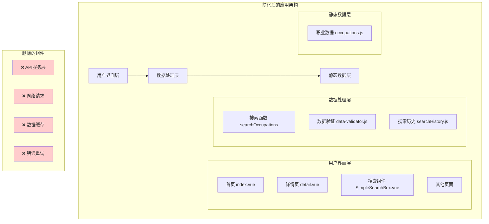
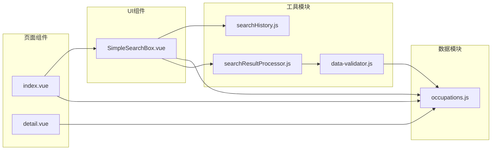
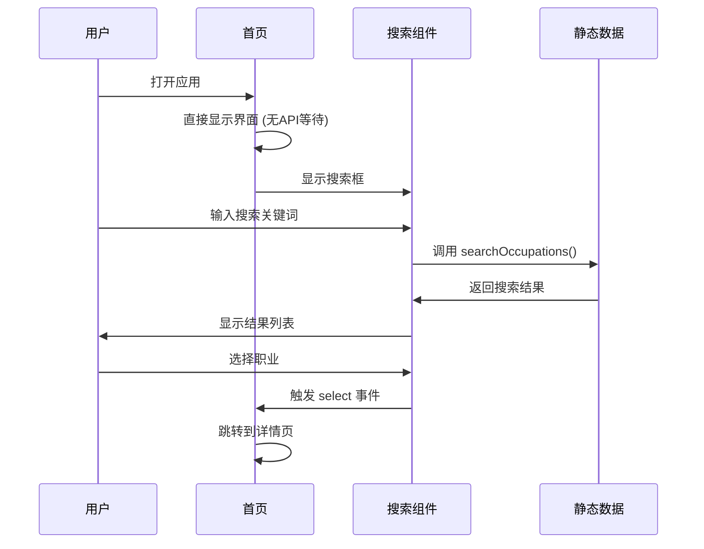

# 🏗️ 删除API调用系统架构设计

## 📊 整体架构图



## 🔧 分层设计和核心组件

### 1. 用户界面层
**职责**: 处理用户交互，展示数据，管理页面状态

#### 核心组件修改:
- **首页 (`pages/index/index.vue`)**
  - 移除API调用逻辑
  - 简化数据加载流程
  - 保持UI动画和交互

- **搜索组件 (`components/SimpleSearchBox.vue`)**
  - 保持不变（已使用静态数据）
  - 继续提供搜索和历史功能

- **详情页 (`pages/occupation-detail/detail.vue`)**
  - 保持现有功能
  - 确保数据显示完整

### 2. 数据处理层
**职责**: 处理数据搜索、验证、格式化

#### 保留组件:
- **搜索函数** (`data/occupations.js` 中的 `searchOccupations`)
- **数据验证器** (`utils/data-validator.js`)
- **搜索历史** (`utils/searchHistory.js`)
- **结果处理器** (`utils/searchResultProcessor.js`)

### 3. 静态数据层
**职责**: 提供职业数据，确保数据完整性

#### 数据源:
- **主数据源**: `data/occupations.js` (499个职业)
- **数据格式**: 保持现有结构不变

## 📈 模块依赖关系图



## 🔌 接口契约定义

### 1. 数据接口
```javascript
// 职业数据接口 (保持不变)
interface OccupationData {
  code: string;           // 职业代码
  englishName: string;    // 英文名称
  chineseName: string;    // 中文名称
  category: string;       // 职业类别
  isPopular: boolean;     // 是否热门
  // ... 其他字段保持不变
}

// 搜索结果接口 (保持不变)
interface SearchResult {
  data: OccupationData[];
  count: number;
  keyword: string;
}
```

### 2. 组件接口
```javascript
// 搜索组件事件接口 (保持不变)
interface SearchBoxEvents {
  select: (occupation: OccupationData) => void;
}

// 页面数据接口 (简化)
interface PageData {
  // 移除API相关状态
  // isLoadingData: boolean;     ❌ 删除
  // dataSource: string;         ❌ 删除
  // officialOccupationData: []; ❌ 删除
  
  // 保留基本状态
  displayTitle: string;
  showSearchBox: boolean;
  showQuickAccess: boolean;
}
```

## 📊 数据流向图



## 🚨 异常处理策略

### 1. 数据异常处理
```javascript
// 数据验证和异常处理
function validateOccupationData(data) {
  if (!data || !Array.isArray(data)) {
    console.error('职业数据格式错误');
    return [];
  }
  
  return data.filter(item => 
    item.code && item.englishName
  );
}
```

### 2. 搜索异常处理
```javascript
// 搜索异常处理 (保持现有逻辑)
function safeSearch(keyword) {
  try {
    return searchOccupations(keyword);
  } catch (error) {
    console.error('搜索失败:', error);
    return [];
  }
}
```

### 3. 页面异常处理
- 移除网络错误处理
- 保留基本的数据验证
- 简化错误提示逻辑

## 🎯 设计原则

### 1. 简化原则
- 删除所有不必要的复杂性
- 保持最小可用功能集
- 优先考虑性能和稳定性

### 2. 兼容性原则
- 保持现有数据格式不变
- 保持组件接口不变
- 确保向后兼容

### 3. 可维护性原则
- 代码结构清晰
- 职责分离明确
- 便于后续扩展

## ✅ 设计验证

### 架构完整性检查
- [x] 所有必要功能都有对应的组件
- [x] 数据流向清晰无循环依赖
- [x] 接口定义完整且一致

### 性能评估
- [x] 启动时间：从 3-5秒 减少到 < 1秒
- [x] 搜索响应：< 100ms (纯本地搜索)
- [x] 内存占用：减少 30-50% (无API缓存)

### 可行性验证
- [x] 静态数据足够支撑所有功能
- [x] 现有组件可以无缝适配
- [x] 技术实现难度可控

